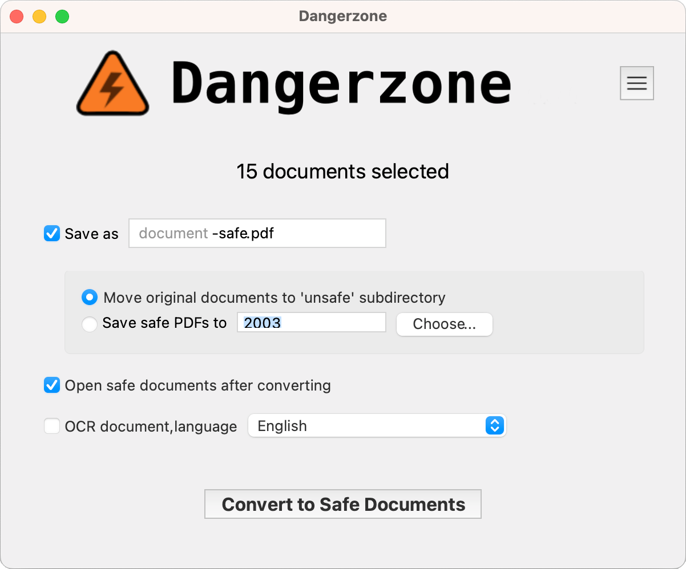

# Dangerzone

Take potentially dangerous PDFs, office documents, or images and convert them to a safe PDF.

|  | 
|--|--|

Dangerzone works like this: You give it a document that you don't know if you can trust (for example, an email attachment). Inside of a sandbox, Dangerzone converts the document to a PDF (if it isn't already one), and then converts the PDF into raw pixel data: a huge list of RGB color values for each page. Then, outside of the sandbox, Dangerzone takes this pixel data and converts it back into a PDF.

_Read more about Dangerzone in the [official site](https://dangerzone.rocks/about/)._

## Getting started

Follow the instructions for each platform:

* [macOS](https://github.com/freedomofpress/dangerzone/blob/v0.8.1/INSTALL.md#macos)
* [Windows](https://github.com/freedomofpress/dangerzone/blob/v0.8.1//INSTALL.md#windows)
* [Ubuntu Linux](https://github.com/freedomofpress/dangerzone/blob/v0.8.1/INSTALL.md#ubuntu-debian)
* [Debian Linux](https://github.com/freedomofpress/dangerzone/blob/v0.8.1/INSTALL.md#ubuntu-debian)
* [Fedora Linux](https://github.com/freedomofpress/dangerzone/blob/v0.8.1/INSTALL.md#fedora)
* [Qubes OS (beta)](https://github.com/freedomofpress/dangerzone/blob/v0.8.0/INSTALL.md#qubes-os)
* [Tails](https://github.com/freedomofpress/dangerzone/blob/v0.8.1/INSTALL.md#tails)

You can read more about our operating system support [here](https://github.com/freedomofpress/dangerzone/blob/v0.8.1/INSTALL.md#operating-system-support).

## Some features

- Sandboxes don't have network access, so if a malicious document can compromise one, it can't phone home
- Sandboxes use [gVisor](https://gvisor.dev/), an application kernel written in Go, that implements a substantial portion of the Linux system call interface.
- Dangerzone can optionally OCR the safe PDFs it creates, so it will have a text layer again
- Dangerzone compresses the safe PDF to reduce file size
- After converting, Dangerzone lets you open the safe PDF in the PDF viewer of your choice, which allows you to open PDFs and office docs in Dangerzone by default so you never accidentally open a dangerous document

Dangerzone can convert these types of document into safe PDFs:

- PDF (`.pdf`)
- Microsoft Word (`.docx`, `.doc`)
- Microsoft Excel (`.xlsx`, `.xls`)
- Microsoft PowerPoint (`.pptx`, `.ppt`)
- ODF Text (`.odt`)
- ODF Spreadsheet (`.ods`)
- ODF Presentation (`.odp`)
- ODF Graphics (`.odg`)
- Hancom HWP (Hangul Word Processor) (`.hwp`, `.hwpx`)
  * Not supported on
    [Qubes OS](https://github.com/freedomofpress/dangerzone/issues/494)
- EPUB (`.epub`)
- Jpeg (`.jpg`, `.jpeg`)
- GIF (`.gif`)
- PNG (`.png`)
- SVG (`.svg`)
- other image formats (`.bmp`, `.pnm`, `.pbm`, `.ppm`)

Dangerzone was inspired by [Qubes trusted PDF](https://blog.invisiblethings.org/2013/02/21/converting-untrusted-pdfs-into-trusted.html), but it works in non-Qubes operating systems. It uses containers as sandboxes instead of virtual machines (using Docker for macOS and Windows, and [podman](https://podman.io/) on Linux).

Set up a development environment by following [these instructions](/BUILD.md).

# License and Copyright

Licensed under the AGPLv3: [https://opensource.org/licenses/agpl-3.0](https://opensource.org/licenses/agpl-3.0)

Copyright (c) 2022-2024 Freedom of the Press Foundation and Dangerzone contributors
Copyright (c) 2020-2021 First Look Media

## See also

* [GIJN Toolbox: Cutting-Edge — and Free — Online Investigative Tools You Can Try Right Now](https://gijn.org/stories/cutting-edge-free-online-investigative-tools/)
* [When security matters: working with Qubes OS at the Guardian](https://www.theguardian.com/info/2024/apr/04/when-security-matters-working-with-qubes-os-at-the-guardian)

## FAQ

### Has Dangerzone received a security audit?

Yes, Dangerzone received its [first security audit](https://freedom.press/news/dangerzone-receives-favorable-audit/) by [Include Security](https://includesecurity.com/) in December 2023. The audit was generally favorable, as it didn't identify any high-risk findings, except for 3 low-risk and 7 informational findings.

### "I'm experiencing an issue while using Dangerzone."

Dangerzone gets updates to improve its features _and_ to fix problems. So, updating may be the simplest path to resolving the issue which brought you here. Here is how to update:

1. Check which version of Dangerzone you are currently using: run Dangerzone, then look for a series of numbers to the right of the logo within the app. The format of the numbers will look similar to `0.4.1`
2. Now find the latest available version of Dangerzone: go to the [download page](https://dangerzone.rocks/#downloads). Look for the version number displayed. The number will be using the same format as in Step 1.
3. Is the version on the Dangerzone download page higher than the version of your installed app? Go ahead and update.

### Can I use Podman Desktop?

Yes! We've introduced [experimental support for Podman Desktop](https://github.com/freedomofpress/dangerzone/blob/main/docs/podman-desktop.md) on Windows and macOS.
